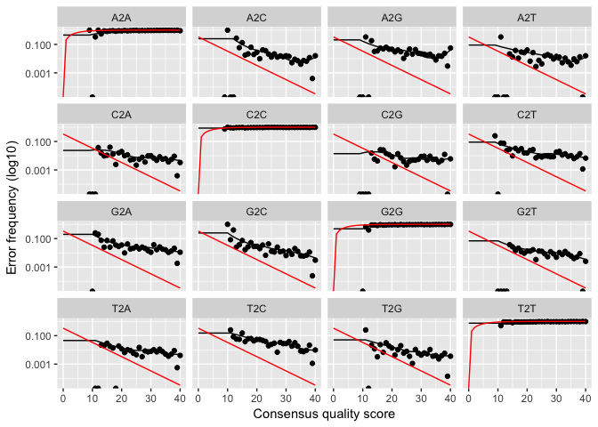
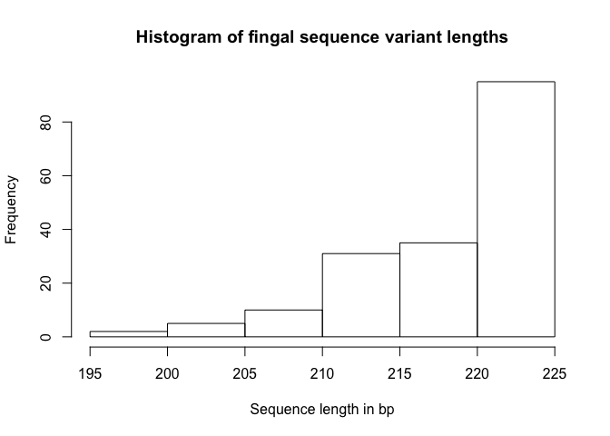
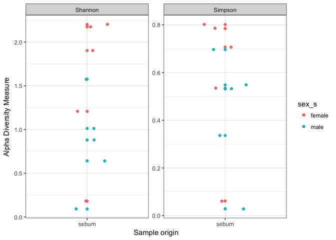
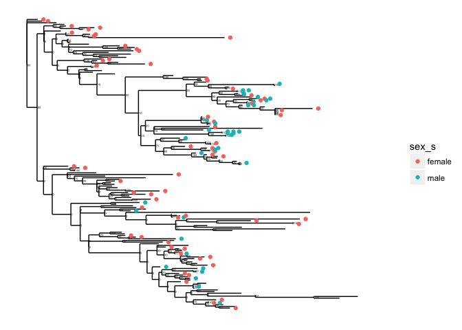
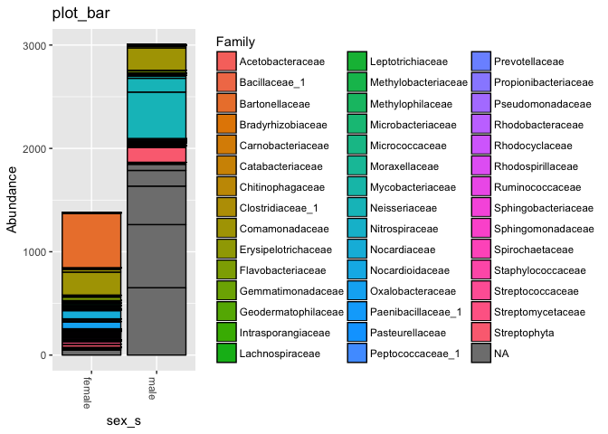

Analysis Report 1: Sex Differentiation via Hand Bacterial Community Diveristy
================
Charlotte Lopp
October 20, 2017

Introduction
============

Forensic identification has been popularized in the public eye via the media - shows like Law and Order and other crime investigatory TV series. Albeit glorified as a speedy process that is often portrayed and a single person's job, forensics and the discoveries made by that department serves often as the turning point for many of the episodes and cases. Based on the science of identifying DNA from trace evidence left at the scene of the crime, forensics (at least in the shows) has often been associated with seminal fluids, blood, fingerprints, and hair. The identification of body fluids, particularly saliva, is important for understanding the events that took place at the crime scene and the details of the crime (Nakanishi *et al.*, 2009). Bacteria is becoming yet another avenue of forensic identification; for example, discrimination of vaginal fluid via bacterial 16S ribosomal RNA genes \[akutsu2012detection\].

Skin is a pivotal point of exchange between the human body and the external environment that surrounds it, playing the role of prevention of moisture loss and keeping harmful organisms at bay (Segre, 2006). It is also an ecosystem and harbors microbial communities that live in a variety of physiologically and topographically unique and distinct niches (Marples and others, 1965). An example of this would be the vast difference between a hairy, moist underarm and a smooth, dry forearm; the disparity between the two is comparable to that of a rainforest and a desert (Grice *et al.*, 2009). In addition to being preferential in terms of habitat, these microbial communities also have specific makeups (Fierer *et al.*, 2010) which make them unique to the individual that they belong to.

It has been established that the diversity of skin-associated bacterial communities has a high enough degree of individual variability that the composition of these communities can be used in forensic indentification. These communities are personally unique, temporally stable, and transferable. Fierer et al. hypothesized, based on this personalized aspect of skin bacterial communities, that they could use the residual skin bacterial left on objects as "fingerprints" to identify the individual who had touched the object. They proposed to do this by matching the bacteria on the object to the skin-associated bacteria of the individual. In order to perform this matching, three criteria must be met: (1) bacterial DNA recovered from touched surfaces allows for adequate characterization and comparison of bacterial communities; (2) skin bacterial communities persist on surfaces for days to weeks; and (3) surfaces that are touched can be effectively linked to individuals by assessing the degree of similarity between the bacterial communities on the object and the skin of the individual who touched the object (Fierer *et al.*, 2010).

In order to meet these criteria and demonstrate the potential of this approach for forensic identification, three interrelated studies were carried out that combined phylogenetic community analyses and high-thorughput pyrosequencing methods. The first experiment entailed comparing bacterial communities on individual keys of three computer keyboards to the communities found on the fingers of the keyboard owners. In the second, the similarity between skin-associated bacterial communities on object stored at -20 degrees Celcius versus those objects stored under typical indoor environmental conditions for up to 14 days were examined. For the third experiment, objects were linked to specific individuals based on comparison of the bacteria on their computer mice to the database containing community information for more than 250 band surfaces, including the hand of the owner. What Fierer et al. discovered was that skin-associated bacteria can be readily recovered from surfaces and that the composition of these communities can indeed be used to determine which individuals touched which objects. This could be determined even if the surfaces had been untouched for up to 2 weeks at room temperature. They demonstrated the utility of a high-throughput pyrosequencing-based approach to quantitatively compare the bacterial communities on objects and skin to match the object to the individual with a high degree of certainty.

In another study conducted by Noah Fierer and his colleagues, sex was examined in terms of its influence on the diversity of hand surface bacteria \[fierer2008influence\]. They found that although there was a core set of bacterial taxa commonly found on the palm surface, there was a pronounced intra- and interpersonal variation in acterial community composition: 17% shared phylotypes between the hands of the same individual; 13% between different individuals. Women had significantly higher diversity than men "whether diversity was assessed by examining the overall phylogenetic structure on each hand or the average number of phylotypes per hand" \[fierer2008influence\]. The sexes also had signficiantly different bacterial communities on their hand surfaces. What drove these differences remained unknown but it was mentioned that skin pH may have a influence as men have generally more acidic skin than women (which leads to lower microbial diversity). Other drivers may include sweat, sebum production, frequency of moisturizer or cosmetics application, skin thickness, or hormone production, but to confirm this other studies have to be conducted.

Methods
=======

Sample origin and sequencing
----------------------------

To obtain data for the keyboard study, about 30 individuals keys of three personal computer keyboards and each fingertip of the owner was swabbed. In order to compare the bacterial communities on the keyboards to other miscellaneous keyboards, space bar keys from 15 other private and public computer keyboards were also swabbed. For the storage study, armput skin was simultaneously swabbed with 16 moistened swabs for each of the two individuals. Half of these swabs were immediately frozen at -20 degrees Celsius while the other half was left at room temperature. To gather data for the computer mouse study, the entire exposed face of each computer mouse and the palm surface of nine individual's dominant hands were swabbed. It was important that the mouse had last been touched by the owner 12 hours before swabbing. Fierer et al. estimated the accuracy of matching the house to the owner of the mouse by measuring the degree of similarity between bacterial communities on each computer mouse to the hands of the mouse's owner and to the hands that had never touched the mouse.

Genomic DNA was extracted from the swabs using the MO BIO PowerSoil DNA Isolation kit. For each sample, 16S rRNA genes were amplified using the primer set (detailed in "The influence of sex, handedness, and washing on the diversity of hand surface bacteria" by Fierer et al. (2008)) that had been optimized for the phylogenetic analysis of pyrosequencing reads. PCR reactions followed by thermal cycling and aplicon cleaning using UltraClean-htp96-well PCR Clean-up kit (MO BIO) were conducted. Amplicon DNA concentrations were measured using the Quant-it PicoGreen dsDNA reagent and kit (Invitrogen). Pyrosequencing was carried out on a 454 Life Sciences Genome Sequencer FLX instrument (Roche) by the Environmental Genomics Core Facility at the University of South Carolina.

Computational
-------------

Computation with this data began with creating a bashscript with code which downloaded the list of 20 files (from the NCBI Sequence Read Archive study number ERP022657) in the run table to the project's data directory. Code was then written to create QC reports for each of the runs using the FastQC program. These 20 sequences were then trimmed based on their quality scores (any sequences below the length of 150 base pairs and any base score below 25 was discarded). The bascript proceeded with code which converted fastq files into fasta files so that they could be used in BLAST queries. Finally, each sequence was blasted with the output written into a csv file; "blastn" was used to search for the top match of each sequence against the *nt* database. These BLAST results are what are now being used for this R-scripted analysis. As the blasting took tens of hours, this session was made sure to be written in a tmux session for the online server.

The results of this BLAST session were taken and filed in a data file named "metadata\_in." This data was primarily manipulated in order to create comprehensive graphs of the data in order to further understand relationships and correlations that might have otherwise been obscured. In this specific report, the aforementioned data was taken and assembled in various ways in order to present the data in a novel way. Two open-source software packages were used in order to manipulate the data: DADA2 and phyloseq. DADA2's strengths lie in modeling and correcting Illumina-sequenced amplicon errors by inferring sample sequencing exactly and resolving differences of as little as 1 nucleotide (Callahan *et al.*, 2016). Phyloseq is dedicated to object-oriented representation and analysis of microbiome census data in R, supporting data importation from a variety of common formats as well as many analysis techniques (McMurdie and Holmes, 2013).

Results
=======

``` r
# Be sure to install these packages before running this script
# They can be installed either with the intall.packages() function
# or with the 'Packages' pane in RStudio

# load general-use packages
library("dplyr")
```

    ## Warning: package 'dplyr' was built under R version 3.4.2

``` r
library("tidyr")
```

    ## Warning: package 'tidyr' was built under R version 3.4.2

``` r
library("knitr")
library("ggplot2")

# this package allows for the easy inclusion of literature citations in our Rmd
# more info here: https://github.com/crsh/citr
# and here:
# http://rmarkdown.rstudio.com/authoring_bibliographies_and_citations.html
library("citr")

# These are the primary packages well use to clean and analyze the data
# this package needs to be installed from bioconductor -- it's not on CRAN
# see info here: https://benjjneb.github.io/dada2/dada-installation.html
library("dada2")
```

    ## Warning: package 'Rcpp' was built under R version 3.4.2

``` r
# This to export a fasta of our final denoised sequence variants
library("seqinr")

# To install this you have to install from GitHub
# See more info here: https://github.com/leffj/mctoolsr
# run this -- install.packages("devtools")
# and then this -- devtools::install_github("leffj/mctoolsr")
library("mctoolsr")

# And this to visualize our results
# it also needs to be installed from bioconductor
library("phyloseq")
```

``` r
# NOTE: Much of the following follows the DADA2 tutorials available here:
# https://benjjneb.github.io/dada2/tutorial.html
# Accessed October 19, 2017

# set the base path for our input data files
path <- "data/raw_data"

# Sort ensures samples are in order
filenames_forward_reads <- sort(list.files(path, pattern = ".fastq"))

# Extract sample names, assuming filenames have format: SAMPLENAME.fastq
sample_names <- sapply(strsplit(filenames_forward_reads, "\\."), `[`, 1)

# Specify the full path to each of the filenames_forward_reads
filenames_forward_reads <- file.path(path, filenames_forward_reads)
```

``` r
# Plots the quality profiles of all twenty samples
plotQualityProfile(filenames_forward_reads[1:20])
```


We can see from the quality profiles that most reads tend to get pretty bad in quality after around 200 bases. Therefore, we decided to set a maximum acceptable sequence length of 225 bases.

``` r
# Place filtered files in filtered/ subdirectory
# note this will fail if the directory doesn't exist
filter_path <- file.path("output", "filtered")
filtered_reads_path <- file.path(filter_path,
                                 paste0(sample_names,
                                        "_filt.fastq.gz"))

# See ?filterAndTrim for details on the parameters
# See here for adjustments for 454 data:
# https://benjjneb.github.io/dada2/
#     faq.html#can-i-use-dada2-with-my-454-or-ion-torrent-data
filtered_output <- filterAndTrim(fwd = filenames_forward_reads,
                                 filt = filtered_reads_path,
                                 maxLen = 225,
                                 maxN = 0, # discard any seqs with Ns
                                 maxEE = 3, # allow w/ up to 3 expected errors
                                 truncQ = 2, # cut off if quality gets this low
                                 rm.phix = TRUE,
                                 compress = TRUE,
                                 multithread = FALSE)
```

``` r
# produce nicely-formatted markdown table of read counts
# before/after trimming
kable(filtered_output,
      col.names = c("Reads In",
                    "Reads Out"))
```

|                  |  Reads In|  Reads Out|
|------------------|---------:|----------:|
| ERR1942280.fastq |       404|        350|
| ERR1942281.fastq |       422|        194|
| ERR1942282.fastq |       412|         31|
| ERR1942283.fastq |       791|        426|
| ERR1942284.fastq |       677|        525|
| ERR1942285.fastq |       443|         72|
| ERR1942286.fastq |       667|        617|
| ERR1942287.fastq |       590|        541|
| ERR1942288.fastq |       908|        877|
| ERR1942289.fastq |       372|        147|
| ERR1942290.fastq |       468|        249|
| ERR1942291.fastq |       933|        819|
| ERR1942292.fastq |       724|        709|
| ERR1942293.fastq |       811|        470|
| ERR1942294.fastq |       938|        552|
| ERR1942295.fastq |       705|        620|
| ERR1942296.fastq |       754|        441|
| ERR1942297.fastq |       275|        246|
| ERR1942298.fastq |       562|        389|
| ERR1942299.fastq |      1025|        852|

Here we see the number of read counts for each of the twenty samples before and after trimming. The trimming was based on the decrease in quality near the end of the reads as seen in the previous Plot Quality Profile figure. This means that "read outs" have been vetted for having a maximum sequence length of 225 base pairs, not having any N's, were allowed up to 3 expected errors, and were cut off if the quality reached as low as truncQ = 2.

``` r
# this build error models from each of the samples
errors_forward_reads <- learnErrors(filtered_reads_path,
                                    multithread = FALSE)
```

    ## Not all sequences were the same length.
    ## Not all sequences were the same length.
    ## Not all sequences were the same length.
    ## Not all sequences were the same length.
    ## Not all sequences were the same length.
    ## Not all sequences were the same length.
    ## Not all sequences were the same length.
    ## Not all sequences were the same length.
    ## Not all sequences were the same length.
    ## Not all sequences were the same length.
    ## Not all sequences were the same length.
    ## Not all sequences were the same length.
    ## Not all sequences were the same length.
    ## Not all sequences were the same length.
    ## Not all sequences were the same length.
    ## Not all sequences were the same length.
    ## Not all sequences were the same length.
    ## Not all sequences were the same length.
    ## Not all sequences were the same length.
    ## Not all sequences were the same length.
    ## Initializing error rates to maximum possible estimate.
    ## Sample 1 - 350 reads in 72 unique sequences.
    ## Sample 2 - 194 reads in 163 unique sequences.
    ## Sample 3 - 31 reads in 25 unique sequences.
    ## Sample 4 - 426 reads in 176 unique sequences.
    ## Sample 5 - 525 reads in 134 unique sequences.
    ## Sample 6 - 72 reads in 65 unique sequences.
    ## Sample 7 - 617 reads in 178 unique sequences.
    ## Sample 8 - 541 reads in 135 unique sequences.
    ## Sample 9 - 877 reads in 201 unique sequences.
    ## Sample 10 - 147 reads in 107 unique sequences.
    ## Sample 11 - 249 reads in 181 unique sequences.
    ## Sample 12 - 819 reads in 212 unique sequences.
    ## Sample 13 - 709 reads in 128 unique sequences.
    ## Sample 14 - 470 reads in 171 unique sequences.
    ## Sample 15 - 552 reads in 250 unique sequences.
    ## Sample 16 - 620 reads in 141 unique sequences.
    ## Sample 17 - 441 reads in 186 unique sequences.
    ## Sample 18 - 246 reads in 88 unique sequences.
    ## Sample 19 - 389 reads in 332 unique sequences.
    ## Sample 20 - 852 reads in 239 unique sequences.
    ##    selfConsist step 2 
    ##    selfConsist step 3 
    ## 
    ## 
    ## Convergence after  3  rounds.
    ## Total reads used:  9127

We can see here the error models for each of the twenty samples with it first being established that not all the sequences are the same length followed by the number of reads (which are the same numbers as the "reads out" column of the previous table) for each sample in their number of unique sequences.

``` r
# quick check to see if error models match data
# (black lines match black points) and are generally decresing left to right
plotErrors(errors_forward_reads,
           nominalQ = TRUE)
```

    ## Warning: Transformation introduced infinite values in continuous y-axis

    ## Warning: Transformation introduced infinite values in continuous y-axis



This figure serves as a check by visualizing the estimated error rates (which were enumerated in the previous figure) to make sure that the error models match the data. The error rates shown are for each possible transition (eg. A -&gt; C, A -&gt; G,...). Each point represents the observed error rate for each consensus quality score. The black line shows the estimated error rates after convergence. The red line shows the error rates expected under the nominal definition of the Q-value. We can see here that each of the black lines (estimated rates) fit the observed rates well in that they follow the general trend of decreasing from left to right. Thus, everything looks safe in terms of error and we can proceed with confidence (Callahan *et al.*, 2016).

``` r
# get rid of any duplicated sequences
dereplicated_forward_reads <- derepFastq(filtered_reads_path,
                                         verbose = TRUE)
```

    ## Dereplicating sequence entries in Fastq file: output/filtered/ERR1942280_filt.fastq.gz

    ## Encountered 72 unique sequences from 350 total sequences read.

    ## Not all sequences were the same length.

    ## Dereplicating sequence entries in Fastq file: output/filtered/ERR1942281_filt.fastq.gz

    ## Encountered 163 unique sequences from 194 total sequences read.

    ## Not all sequences were the same length.

    ## Dereplicating sequence entries in Fastq file: output/filtered/ERR1942282_filt.fastq.gz

    ## Encountered 25 unique sequences from 31 total sequences read.

    ## Not all sequences were the same length.

    ## Dereplicating sequence entries in Fastq file: output/filtered/ERR1942283_filt.fastq.gz

    ## Encountered 176 unique sequences from 426 total sequences read.

    ## Not all sequences were the same length.

    ## Dereplicating sequence entries in Fastq file: output/filtered/ERR1942284_filt.fastq.gz

    ## Encountered 134 unique sequences from 525 total sequences read.

    ## Not all sequences were the same length.

    ## Dereplicating sequence entries in Fastq file: output/filtered/ERR1942285_filt.fastq.gz

    ## Encountered 65 unique sequences from 72 total sequences read.

    ## Not all sequences were the same length.

    ## Dereplicating sequence entries in Fastq file: output/filtered/ERR1942286_filt.fastq.gz

    ## Encountered 178 unique sequences from 617 total sequences read.

    ## Not all sequences were the same length.

    ## Dereplicating sequence entries in Fastq file: output/filtered/ERR1942287_filt.fastq.gz

    ## Encountered 135 unique sequences from 541 total sequences read.

    ## Not all sequences were the same length.

    ## Dereplicating sequence entries in Fastq file: output/filtered/ERR1942288_filt.fastq.gz

    ## Encountered 201 unique sequences from 877 total sequences read.

    ## Not all sequences were the same length.

    ## Dereplicating sequence entries in Fastq file: output/filtered/ERR1942289_filt.fastq.gz

    ## Encountered 107 unique sequences from 147 total sequences read.

    ## Not all sequences were the same length.

    ## Dereplicating sequence entries in Fastq file: output/filtered/ERR1942290_filt.fastq.gz

    ## Encountered 181 unique sequences from 249 total sequences read.

    ## Not all sequences were the same length.

    ## Dereplicating sequence entries in Fastq file: output/filtered/ERR1942291_filt.fastq.gz

    ## Encountered 212 unique sequences from 819 total sequences read.

    ## Not all sequences were the same length.

    ## Dereplicating sequence entries in Fastq file: output/filtered/ERR1942292_filt.fastq.gz

    ## Encountered 128 unique sequences from 709 total sequences read.

    ## Not all sequences were the same length.

    ## Dereplicating sequence entries in Fastq file: output/filtered/ERR1942293_filt.fastq.gz

    ## Encountered 171 unique sequences from 470 total sequences read.

    ## Not all sequences were the same length.

    ## Dereplicating sequence entries in Fastq file: output/filtered/ERR1942294_filt.fastq.gz

    ## Encountered 250 unique sequences from 552 total sequences read.

    ## Not all sequences were the same length.

    ## Dereplicating sequence entries in Fastq file: output/filtered/ERR1942295_filt.fastq.gz

    ## Encountered 141 unique sequences from 620 total sequences read.

    ## Not all sequences were the same length.

    ## Dereplicating sequence entries in Fastq file: output/filtered/ERR1942296_filt.fastq.gz

    ## Encountered 186 unique sequences from 441 total sequences read.

    ## Not all sequences were the same length.

    ## Dereplicating sequence entries in Fastq file: output/filtered/ERR1942297_filt.fastq.gz

    ## Encountered 88 unique sequences from 246 total sequences read.

    ## Not all sequences were the same length.

    ## Dereplicating sequence entries in Fastq file: output/filtered/ERR1942298_filt.fastq.gz

    ## Encountered 332 unique sequences from 389 total sequences read.

    ## Not all sequences were the same length.

    ## Dereplicating sequence entries in Fastq file: output/filtered/ERR1942299_filt.fastq.gz

    ## Encountered 239 unique sequences from 852 total sequences read.

    ## Not all sequences were the same length.

``` r
# Name the derep-class objects by the sample names
names(dereplicated_forward_reads) <- sample_names
```

``` r
# parameters adjusted based on recommendations for 454 data here:
# https://benjjneb.github.io/dada2/
#     faq.html#can-i-use-dada2-with-my-454-or-ion-torrent-data
dada_forward_reads <- dada(dereplicated_forward_reads,
                           err = errors_forward_reads,
                           HOMOPOLYMER_GAP_PENALTY = -1, # reduce penalty bc 454
                           BAND_SIZE = 32) # performs local alignments bc indels
```

    ## Sample 1 - 350 reads in 72 unique sequences.
    ## Sample 2 - 194 reads in 163 unique sequences.
    ## Sample 3 - 31 reads in 25 unique sequences.
    ## Sample 4 - 426 reads in 176 unique sequences.
    ## Sample 5 - 525 reads in 134 unique sequences.
    ## Sample 6 - 72 reads in 65 unique sequences.
    ## Sample 7 - 617 reads in 178 unique sequences.
    ## Sample 8 - 541 reads in 135 unique sequences.
    ## Sample 9 - 877 reads in 201 unique sequences.
    ## Sample 10 - 147 reads in 107 unique sequences.
    ## Sample 11 - 249 reads in 181 unique sequences.
    ## Sample 12 - 819 reads in 212 unique sequences.
    ## Sample 13 - 709 reads in 128 unique sequences.
    ## Sample 14 - 470 reads in 171 unique sequences.
    ## Sample 15 - 552 reads in 250 unique sequences.
    ## Sample 16 - 620 reads in 141 unique sequences.
    ## Sample 17 - 441 reads in 186 unique sequences.
    ## Sample 18 - 246 reads in 88 unique sequences.
    ## Sample 19 - 389 reads in 332 unique sequences.
    ## Sample 20 - 852 reads in 239 unique sequences.

``` r
# check dada results
dada_forward_reads
```

    ## $ERR1942280
    ## dada-class: object describing DADA2 denoising results
    ## 3 sample sequences were inferred from 72 input unique sequences.
    ## Key parameters: OMEGA_A = 1e-40, BAND_SIZE = 32, USE_QUALS = TRUE
    ## 
    ## $ERR1942281
    ## dada-class: object describing DADA2 denoising results
    ## 18 sample sequences were inferred from 163 input unique sequences.
    ## Key parameters: OMEGA_A = 1e-40, BAND_SIZE = 32, USE_QUALS = TRUE
    ## 
    ## $ERR1942282
    ## dada-class: object describing DADA2 denoising results
    ## 3 sample sequences were inferred from 25 input unique sequences.
    ## Key parameters: OMEGA_A = 1e-40, BAND_SIZE = 32, USE_QUALS = TRUE
    ## 
    ## $ERR1942283
    ## dada-class: object describing DADA2 denoising results
    ## 17 sample sequences were inferred from 176 input unique sequences.
    ## Key parameters: OMEGA_A = 1e-40, BAND_SIZE = 32, USE_QUALS = TRUE
    ## 
    ## $ERR1942284
    ## dada-class: object describing DADA2 denoising results
    ## 4 sample sequences were inferred from 134 input unique sequences.
    ## Key parameters: OMEGA_A = 1e-40, BAND_SIZE = 32, USE_QUALS = TRUE
    ## 
    ## $ERR1942285
    ## dada-class: object describing DADA2 denoising results
    ## 7 sample sequences were inferred from 65 input unique sequences.
    ## Key parameters: OMEGA_A = 1e-40, BAND_SIZE = 32, USE_QUALS = TRUE
    ## 
    ## $ERR1942286
    ## dada-class: object describing DADA2 denoising results
    ## 8 sample sequences were inferred from 178 input unique sequences.
    ## Key parameters: OMEGA_A = 1e-40, BAND_SIZE = 32, USE_QUALS = TRUE
    ## 
    ## $ERR1942287
    ## dada-class: object describing DADA2 denoising results
    ## 5 sample sequences were inferred from 135 input unique sequences.
    ## Key parameters: OMEGA_A = 1e-40, BAND_SIZE = 32, USE_QUALS = TRUE
    ## 
    ## $ERR1942288
    ## dada-class: object describing DADA2 denoising results
    ## 5 sample sequences were inferred from 201 input unique sequences.
    ## Key parameters: OMEGA_A = 1e-40, BAND_SIZE = 32, USE_QUALS = TRUE
    ## 
    ## $ERR1942289
    ## dada-class: object describing DADA2 denoising results
    ## 17 sample sequences were inferred from 107 input unique sequences.
    ## Key parameters: OMEGA_A = 1e-40, BAND_SIZE = 32, USE_QUALS = TRUE
    ## 
    ## $ERR1942290
    ## dada-class: object describing DADA2 denoising results
    ## 13 sample sequences were inferred from 181 input unique sequences.
    ## Key parameters: OMEGA_A = 1e-40, BAND_SIZE = 32, USE_QUALS = TRUE
    ## 
    ## $ERR1942291
    ## dada-class: object describing DADA2 denoising results
    ## 8 sample sequences were inferred from 212 input unique sequences.
    ## Key parameters: OMEGA_A = 1e-40, BAND_SIZE = 32, USE_QUALS = TRUE
    ## 
    ## $ERR1942292
    ## dada-class: object describing DADA2 denoising results
    ## 3 sample sequences were inferred from 128 input unique sequences.
    ## Key parameters: OMEGA_A = 1e-40, BAND_SIZE = 32, USE_QUALS = TRUE
    ## 
    ## $ERR1942293
    ## dada-class: object describing DADA2 denoising results
    ## 11 sample sequences were inferred from 171 input unique sequences.
    ## Key parameters: OMEGA_A = 1e-40, BAND_SIZE = 32, USE_QUALS = TRUE
    ## 
    ## $ERR1942294
    ## dada-class: object describing DADA2 denoising results
    ## 30 sample sequences were inferred from 250 input unique sequences.
    ## Key parameters: OMEGA_A = 1e-40, BAND_SIZE = 32, USE_QUALS = TRUE
    ## 
    ## $ERR1942295
    ## dada-class: object describing DADA2 denoising results
    ## 4 sample sequences were inferred from 141 input unique sequences.
    ## Key parameters: OMEGA_A = 1e-40, BAND_SIZE = 32, USE_QUALS = TRUE
    ## 
    ## $ERR1942296
    ## dada-class: object describing DADA2 denoising results
    ## 17 sample sequences were inferred from 186 input unique sequences.
    ## Key parameters: OMEGA_A = 1e-40, BAND_SIZE = 32, USE_QUALS = TRUE
    ## 
    ## $ERR1942297
    ## dada-class: object describing DADA2 denoising results
    ## 5 sample sequences were inferred from 88 input unique sequences.
    ## Key parameters: OMEGA_A = 1e-40, BAND_SIZE = 32, USE_QUALS = TRUE
    ## 
    ## $ERR1942298
    ## dada-class: object describing DADA2 denoising results
    ## 21 sample sequences were inferred from 332 input unique sequences.
    ## Key parameters: OMEGA_A = 1e-40, BAND_SIZE = 32, USE_QUALS = TRUE
    ## 
    ## $ERR1942299
    ## dada-class: object describing DADA2 denoising results
    ## 8 sample sequences were inferred from 239 input unique sequences.
    ## Key parameters: OMEGA_A = 1e-40, BAND_SIZE = 32, USE_QUALS = TRUE

This is dereplication which means we are combining all identical sequencing reads into "unique sequences" with a corresponding "abundance:" the number of reads with that unique sequence (in this case, the number of sample sequences that were inferred from however many input unique sequences). Because dereplication was done within the DADA2 pipeline, a summary of the quality information associated with each unique sequence was retained. The consensus quality profile of a unique sequence is the average of the positional qualities from the dereplicated reads. These quality profiles inform the error model of the subsequent denoising step, significantly increasing DADA2's accuracy (Callahan *et al.*, 2016).

``` r
# produce the 'site by species matrix'
sequence_table <- makeSequenceTable(dada_forward_reads)
```

    ## The sequences being tabled vary in length.

The output table has 20 rows (samples) and 178 columns (sequence variants). Notice how we can embed R code directly in our markdown text.

``` r
# Quick check to look at distribution of trimmed and denoised sequences
hist(nchar(getSequences(sequence_table)),
     main = "Histogram of fingal sequence variant lengths",
     xlab = "Sequence length in bp")
```



This histogram serves as visualization of the distribution of the trimmed and denoised sequences. The increase in frequency along the increase of sequence length in base pairs follows an exponential curve. Thus, the shortest sequences appear the least and the longest sequences appear the most.

``` r
# Check for and remove chimeras
sequence_table_nochim <- removeBimeraDenovo(sequence_table,
                                            method = "consensus",
                                            multithread = FALSE,
                                            verbose = TRUE)
```

    ## Identified 2 bimeras out of 178 input sequences.

``` r
# What percent of our reads are non-chimeric?
non_chimeric_reads <- round(sum(sequence_table_nochim) / sum(sequence_table),
                            digits = 4) * 100
```

After removing chimeras, we were left with 99.65% of our cleaned reads.

``` r
# Build a table showing how many sequences remain at each step of the pipeline
get_n <- function(x) sum(getUniques(x)) # make a quick function
track <- cbind(filtered_output, # already has 2 columns
               sapply(dada_forward_reads, get_n),
               rowSums(sequence_table),
               rowSums(sequence_table_nochim))

# add nice meaningful column names
colnames(track) <- c("Input",
                     "Filtered",
                     "Denoised",
                     "Sequence Table",
                     "Non-chimeric")

# set the proper rownames
rownames(track) <- sample_names

# produce nice markdown table of progress through the pipeline
kable(track)
```

|            |  Input|  Filtered|  Denoised|  Sequence Table|  Non-chimeric|
|------------|------:|---------:|---------:|---------------:|-------------:|
| ERR1942280 |    404|       350|       350|             350|           350|
| ERR1942281 |    422|       194|       194|             194|           194|
| ERR1942282 |    412|        31|        31|              31|            31|
| ERR1942283 |    791|       426|       426|             426|           426|
| ERR1942284 |    677|       525|       525|             525|           525|
| ERR1942285 |    443|        72|        72|              72|            72|
| ERR1942286 |    667|       617|       617|             617|           585|
| ERR1942287 |    590|       541|       541|             541|           541|
| ERR1942288 |    908|       877|       877|             877|           877|
| ERR1942289 |    372|       147|       147|             147|           147|
| ERR1942290 |    468|       249|       249|             249|           249|
| ERR1942291 |    933|       819|       819|             819|           819|
| ERR1942292 |    724|       709|       709|             709|           709|
| ERR1942293 |    811|       470|       470|             470|           470|
| ERR1942294 |    938|       552|       552|             552|           552|
| ERR1942295 |    705|       620|       620|             620|           620|
| ERR1942296 |    754|       441|       441|             441|           441|
| ERR1942297 |    275|       246|       246|             246|           246|
| ERR1942298 |    562|       389|       389|             389|           389|
| ERR1942299 |   1025|       852|       852|             852|           852|

Here, the values in the columns "input" and "filtered" should look familiar from the table looking at the read counts for each of the twenty sequences before and after the quality trim. The values for the columns "denoised," "sequence table," and "non-chimeric" are all the same as those under "filtered" except for the non-chimeric value for ERR1942286.

``` r
# assigns taxonomy to each sequence variant based on a supplied training set
# made up of known sequences
taxa <- assignTaxonomy(sequence_table_nochim,
                       "data/training/rdp_train_set_16.fa.gz",
                       multithread = FALSE,
                       tryRC = TRUE) # also check with seq reverse compliments

# show the results of the taxonomy assignment
unname(taxa)
```

    ##        [,1]       [,2]                        [,3]                 
    ##   [1,] "Bacteria" "Proteobacteria"            NA                   
    ##   [2,] "Bacteria" "Proteobacteria"            "Alphaproteobacteria"
    ##   [3,] "Bacteria" "Bacteroidetes"             "Cytophagia"         
    ##   [4,] "Bacteria" "Proteobacteria"            NA                   
    ##   [5,] "Bacteria" "Proteobacteria"            "Betaproteobacteria" 
    ##   [6,] "Bacteria" "Cyanobacteria/Chloroplast" "Chloroplast"        
    ##   [7,] "Bacteria" "Proteobacteria"            "Betaproteobacteria" 
    ##   [8,] "Bacteria" "Bacteroidetes"             NA                   
    ##   [9,] "Bacteria" "Proteobacteria"            "Alphaproteobacteria"
    ##  [10,] "Bacteria" "Proteobacteria"            "Betaproteobacteria" 
    ##  [11,] "Bacteria" "Proteobacteria"            NA                   
    ##  [12,] "Bacteria" "Actinobacteria"            "Actinobacteria"     
    ##  [13,] "Bacteria" "Cyanobacteria/Chloroplast" "Chloroplast"        
    ##  [14,] "Bacteria" "Proteobacteria"            "Betaproteobacteria" 
    ##  [15,] "Bacteria" "Proteobacteria"            "Betaproteobacteria" 
    ##  [16,] "Bacteria" "Proteobacteria"            NA                   
    ##  [17,] "Bacteria" "Bacteroidetes"             "Flavobacteriia"     
    ##  [18,] "Bacteria" "Firmicutes"                "Clostridia"         
    ##  [19,] "Bacteria" NA                          NA                   
    ##  [20,] "Bacteria" "Proteobacteria"            "Betaproteobacteria" 
    ##  [21,] "Bacteria" "Firmicutes"                "Clostridia"         
    ##  [22,] "Bacteria" "Firmicutes"                "Clostridia"         
    ##  [23,] "Bacteria" "Firmicutes"                "Clostridia"         
    ##  [24,] "Bacteria" "Firmicutes"                "Clostridia"         
    ##  [25,] "Bacteria" "Proteobacteria"            "Betaproteobacteria" 
    ##  [26,] "Bacteria" "Cyanobacteria/Chloroplast" "Chloroplast"        
    ##  [27,] "Bacteria" "Firmicutes"                "Clostridia"         
    ##  [28,] "Bacteria" "Actinobacteria"            "Actinobacteria"     
    ##  [29,] "Bacteria" "Firmicutes"                "Clostridia"         
    ##  [30,] "Bacteria" "Proteobacteria"            "Alphaproteobacteria"
    ##  [31,] "Bacteria" "Actinobacteria"            "Actinobacteria"     
    ##  [32,] "Bacteria" "Actinobacteria"            "Actinobacteria"     
    ##  [33,] "Bacteria" "Actinobacteria"            "Actinobacteria"     
    ##  [34,] "Bacteria" "Actinobacteria"            "Actinobacteria"     
    ##  [35,] "Bacteria" "Firmicutes"                "Clostridia"         
    ##  [36,] "Bacteria" "Proteobacteria"            "Betaproteobacteria" 
    ##  [37,] "Bacteria" "Proteobacteria"            "Alphaproteobacteria"
    ##  [38,] "Bacteria" "Actinobacteria"            "Actinobacteria"     
    ##  [39,] "Bacteria" "Cyanobacteria/Chloroplast" "Chloroplast"        
    ##  [40,] "Bacteria" "Bacteroidetes"             "Flavobacteriia"     
    ##  [41,] "Bacteria" "Firmicutes"                "Bacilli"            
    ##  [42,] "Bacteria" "Firmicutes"                "Clostridia"         
    ##  [43,] "Bacteria" "Proteobacteria"            "Betaproteobacteria" 
    ##  [44,] "Bacteria" "Firmicutes"                "Clostridia"         
    ##  [45,] "Bacteria" "Proteobacteria"            "Gammaproteobacteria"
    ##  [46,] "Bacteria" "Actinobacteria"            "Actinobacteria"     
    ##  [47,] "Bacteria" "Firmicutes"                "Clostridia"         
    ##  [48,] "Bacteria" "Proteobacteria"            "Betaproteobacteria" 
    ##  [49,] "Bacteria" "Actinobacteria"            "Actinobacteria"     
    ##  [50,] "Bacteria" "Actinobacteria"            "Actinobacteria"     
    ##  [51,] "Bacteria" "Actinobacteria"            "Actinobacteria"     
    ##  [52,] "Bacteria" "Firmicutes"                "Clostridia"         
    ##  [53,] "Bacteria" "Actinobacteria"            "Actinobacteria"     
    ##  [54,] "Bacteria" "Proteobacteria"            "Alphaproteobacteria"
    ##  [55,] "Bacteria" "Firmicutes"                NA                   
    ##  [56,] "Bacteria" "Actinobacteria"            "Actinobacteria"     
    ##  [57,] "Bacteria" "Firmicutes"                "Clostridia"         
    ##  [58,] "Bacteria" "Proteobacteria"            "Gammaproteobacteria"
    ##  [59,] "Bacteria" "Proteobacteria"            NA                   
    ##  [60,] "Bacteria" "Firmicutes"                "Clostridia"         
    ##  [61,] "Bacteria" "Firmicutes"                "Clostridia"         
    ##  [62,] "Bacteria" "Proteobacteria"            "Alphaproteobacteria"
    ##  [63,] "Bacteria" "Firmicutes"                NA                   
    ##  [64,] "Bacteria" "Actinobacteria"            "Actinobacteria"     
    ##  [65,] "Bacteria" "Actinobacteria"            "Actinobacteria"     
    ##  [66,] "Bacteria" "Actinobacteria"            "Actinobacteria"     
    ##  [67,] "Bacteria" "Proteobacteria"            "Alphaproteobacteria"
    ##  [68,] "Bacteria" "Firmicutes"                "Clostridia"         
    ##  [69,] "Bacteria" "Firmicutes"                "Clostridia"         
    ##  [70,] "Bacteria" "Proteobacteria"            "Alphaproteobacteria"
    ##  [71,] "Bacteria" "Firmicutes"                "Clostridia"         
    ##  [72,] "Bacteria" "Proteobacteria"            "Betaproteobacteria" 
    ##  [73,] "Bacteria" "Firmicutes"                "Clostridia"         
    ##  [74,] "Bacteria" "Actinobacteria"            "Actinobacteria"     
    ##  [75,] "Bacteria" "Cyanobacteria/Chloroplast" "Chloroplast"        
    ##  [76,] "Bacteria" "Firmicutes"                "Clostridia"         
    ##  [77,] "Bacteria" "Actinobacteria"            "Actinobacteria"     
    ##  [78,] "Bacteria" "Actinobacteria"            "Actinobacteria"     
    ##  [79,] "Bacteria" "Actinobacteria"            "Actinobacteria"     
    ##  [80,] "Bacteria" "Firmicutes"                "Clostridia"         
    ##  [81,] "Bacteria" "Bacteroidetes"             "Flavobacteriia"     
    ##  [82,] "Bacteria" "Actinobacteria"            "Actinobacteria"     
    ##  [83,] "Bacteria" "Proteobacteria"            "Alphaproteobacteria"
    ##  [84,] "Bacteria" "Firmicutes"                "Clostridia"         
    ##  [85,] "Bacteria" "Proteobacteria"            "Betaproteobacteria" 
    ##  [86,] "Bacteria" "Proteobacteria"            "Alphaproteobacteria"
    ##  [87,] "Bacteria" "Cyanobacteria/Chloroplast" "Chloroplast"        
    ##  [88,] "Bacteria" "Firmicutes"                "Clostridia"         
    ##  [89,] "Bacteria" "Proteobacteria"            "Gammaproteobacteria"
    ##  [90,] "Bacteria" "Proteobacteria"            "Betaproteobacteria" 
    ##  [91,] "Bacteria" "Gemmatimonadetes"          "Gemmatimonadetes"   
    ##  [92,] "Bacteria" "Actinobacteria"            "Actinobacteria"     
    ##  [93,] "Bacteria" "Proteobacteria"            "Betaproteobacteria" 
    ##  [94,] "Bacteria" "Firmicutes"                "Bacilli"            
    ##  [95,] "Bacteria" "Firmicutes"                "Clostridia"         
    ##  [96,] "Bacteria" "Actinobacteria"            "Actinobacteria"     
    ##  [97,] "Bacteria" "Proteobacteria"            NA                   
    ##  [98,] "Bacteria" "Actinobacteria"            "Actinobacteria"     
    ##  [99,] "Bacteria" "Actinobacteria"            "Actinobacteria"     
    ## [100,] "Bacteria" "Firmicutes"                "Clostridia"         
    ## [101,] "Bacteria" "Firmicutes"                "Clostridia"         
    ## [102,] "Bacteria" "Firmicutes"                "Clostridia"         
    ## [103,] "Bacteria" "Firmicutes"                "Clostridia"         
    ## [104,] "Bacteria" "Actinobacteria"            "Actinobacteria"     
    ## [105,] "Bacteria" "Firmicutes"                "Clostridia"         
    ## [106,] "Bacteria" NA                          NA                   
    ## [107,] "Bacteria" "Firmicutes"                "Clostridia"         
    ## [108,] "Bacteria" "Bacteroidetes"             "Sphingobacteriia"   
    ## [109,] "Bacteria" "Firmicutes"                "Bacilli"            
    ## [110,] "Bacteria" "Gemmatimonadetes"          "Gemmatimonadetes"   
    ## [111,] "Bacteria" "Actinobacteria"            "Actinobacteria"     
    ## [112,] "Bacteria" "Firmicutes"                "Bacilli"            
    ## [113,] "Bacteria" "Bacteroidetes"             "Sphingobacteriia"   
    ## [114,] "Bacteria" "Firmicutes"                "Clostridia"         
    ## [115,] "Bacteria" "Firmicutes"                "Clostridia"         
    ## [116,] "Bacteria" "Firmicutes"                "Clostridia"         
    ## [117,] "Bacteria" "Actinobacteria"            "Actinobacteria"     
    ## [118,] "Bacteria" "Proteobacteria"            "Alphaproteobacteria"
    ## [119,] "Bacteria" "Firmicutes"                "Clostridia"         
    ## [120,] "Bacteria" "Firmicutes"                "Clostridia"         
    ## [121,] "Bacteria" "Proteobacteria"            "Alphaproteobacteria"
    ## [122,] "Bacteria" "Firmicutes"                "Clostridia"         
    ## [123,] "Bacteria" "Actinobacteria"            "Actinobacteria"     
    ## [124,] "Bacteria" "Firmicutes"                "Bacilli"            
    ## [125,] "Bacteria" "Firmicutes"                "Clostridia"         
    ## [126,] "Bacteria" "Firmicutes"                "Bacilli"            
    ## [127,] "Bacteria" "Firmicutes"                "Clostridia"         
    ## [128,] "Bacteria" "Proteobacteria"            "Alphaproteobacteria"
    ## [129,] "Bacteria" "Proteobacteria"            "Alphaproteobacteria"
    ## [130,] "Bacteria" "Spirochaetes"              "Spirochaetia"       
    ## [131,] "Bacteria" "Firmicutes"                "Clostridia"         
    ## [132,] "Bacteria" NA                          NA                   
    ## [133,] "Bacteria" "Firmicutes"                NA                   
    ## [134,] "Bacteria" "Proteobacteria"            "Gammaproteobacteria"
    ## [135,] "Bacteria" "Firmicutes"                "Clostridia"         
    ## [136,] "Bacteria" "Proteobacteria"            "Alphaproteobacteria"
    ## [137,] "Bacteria" "Proteobacteria"            "Alphaproteobacteria"
    ## [138,] "Bacteria" "Firmicutes"                "Clostridia"         
    ## [139,] "Bacteria" "Proteobacteria"            "Betaproteobacteria" 
    ## [140,] "Bacteria" "Firmicutes"                "Erysipelotrichia"   
    ## [141,] "Bacteria" "Actinobacteria"            "Actinobacteria"     
    ## [142,] "Bacteria" "Actinobacteria"            "Actinobacteria"     
    ## [143,] "Bacteria" "Firmicutes"                "Clostridia"         
    ## [144,] "Bacteria" "Actinobacteria"            "Actinobacteria"     
    ## [145,] "Bacteria" "Firmicutes"                "Clostridia"         
    ## [146,] "Bacteria" "Actinobacteria"            "Actinobacteria"     
    ## [147,] "Bacteria" "Firmicutes"                "Clostridia"         
    ## [148,] "Bacteria" "Bacteroidetes"             "Sphingobacteriia"   
    ## [149,] "Bacteria" "Firmicutes"                "Clostridia"         
    ## [150,] "Bacteria" "Proteobacteria"            "Alphaproteobacteria"
    ## [151,] "Bacteria" "Actinobacteria"            "Actinobacteria"     
    ## [152,] "Bacteria" "Firmicutes"                "Clostridia"         
    ## [153,] "Bacteria" "Bacteroidetes"             "Bacteroidia"        
    ## [154,] "Bacteria" NA                          NA                   
    ## [155,] "Bacteria" "Proteobacteria"            NA                   
    ## [156,] "Bacteria" "Firmicutes"                "Clostridia"         
    ## [157,] "Bacteria" "Firmicutes"                "Clostridia"         
    ## [158,] "Bacteria" "Firmicutes"                "Clostridia"         
    ## [159,] "Bacteria" "Firmicutes"                "Bacilli"            
    ## [160,] "Bacteria" "Bacteroidetes"             "Flavobacteriia"     
    ## [161,] "Bacteria" "Fusobacteria"              "Fusobacteriia"      
    ## [162,] "Bacteria" "Firmicutes"                "Clostridia"         
    ## [163,] "Bacteria" "Firmicutes"                "Bacilli"            
    ## [164,] "Bacteria" "Firmicutes"                "Clostridia"         
    ## [165,] "Bacteria" "Nitrospirae"               "Nitrospira"         
    ## [166,] "Bacteria" "Parcubacteria"             NA                   
    ## [167,] "Bacteria" "Firmicutes"                "Bacilli"            
    ## [168,] "Bacteria" "Proteobacteria"            "Betaproteobacteria" 
    ## [169,] "Bacteria" "Bacteroidetes"             "Sphingobacteriia"   
    ## [170,] "Bacteria" "Actinobacteria"            "Actinobacteria"     
    ## [171,] "Bacteria" "Proteobacteria"            "Alphaproteobacteria"
    ## [172,] "Bacteria" "Firmicutes"                "Clostridia"         
    ## [173,] "Bacteria" "Firmicutes"                "Clostridia"         
    ## [174,] "Bacteria" "Actinobacteria"            "Actinobacteria"     
    ## [175,] "Bacteria" "Proteobacteria"            "Gammaproteobacteria"
    ## [176,] "Bacteria" "Actinobacteria"            "Actinobacteria"     
    ##        [,4]                 [,5]                  
    ##   [1,] NA                   NA                    
    ##   [2,] "Rhizobiales"        "Bartonellaceae"      
    ##   [3,] "Cytophagales"       NA                    
    ##   [4,] NA                   NA                    
    ##   [5,] "Neisseriales"       "Neisseriaceae"       
    ##   [6,] "Chloroplast"        "Streptophyta"        
    ##   [7,] "Burkholderiales"    "Comamonadaceae"      
    ##   [8,] NA                   NA                    
    ##   [9,] "Rhizobiales"        "Bartonellaceae"      
    ##  [10,] "Burkholderiales"    "Oxalobacteraceae"    
    ##  [11,] NA                   NA                    
    ##  [12,] "Actinomycetales"    "Nocardiaceae"        
    ##  [13,] "Chloroplast"        "Streptophyta"        
    ##  [14,] "Burkholderiales"    "Oxalobacteraceae"    
    ##  [15,] "Neisseriales"       "Neisseriaceae"       
    ##  [16,] NA                   NA                    
    ##  [17,] "Flavobacteriales"   "Flavobacteriaceae"   
    ##  [18,] "Clostridiales"      "Lachnospiraceae"     
    ##  [19,] NA                   NA                    
    ##  [20,] "Burkholderiales"    "Comamonadaceae"      
    ##  [21,] "Clostridiales"      "Ruminococcaceae"     
    ##  [22,] "Clostridiales"      "Ruminococcaceae"     
    ##  [23,] "Clostridiales"      "Ruminococcaceae"     
    ##  [24,] "Clostridiales"      "Lachnospiraceae"     
    ##  [25,] "Burkholderiales"    "Comamonadaceae"      
    ##  [26,] "Chloroplast"        "Streptophyta"        
    ##  [27,] "Clostridiales"      "Ruminococcaceae"     
    ##  [28,] "Actinomycetales"    "Streptomycetaceae"   
    ##  [29,] "Clostridiales"      "Ruminococcaceae"     
    ##  [30,] "Sphingomonadales"   "Sphingomonadaceae"   
    ##  [31,] "Actinomycetales"    "Nocardioidaceae"     
    ##  [32,] "Actinomycetales"    "Streptomycetaceae"   
    ##  [33,] "Actinomycetales"    "Microbacteriaceae"   
    ##  [34,] "Actinomycetales"    "Streptomycetaceae"   
    ##  [35,] "Clostridiales"      "Ruminococcaceae"     
    ##  [36,] "Methylophilales"    "Methylophilaceae"    
    ##  [37,] "Sphingomonadales"   "Sphingomonadaceae"   
    ##  [38,] "Actinomycetales"    "Intrasporangiaceae"  
    ##  [39,] "Chloroplast"        "Streptophyta"        
    ##  [40,] "Flavobacteriales"   "Flavobacteriaceae"   
    ##  [41,] "Lactobacillales"    "Streptococcaceae"    
    ##  [42,] "Clostridiales"      "Ruminococcaceae"     
    ##  [43,] "Rhodocyclales"      "Rhodocyclaceae"      
    ##  [44,] "Clostridiales"      "Ruminococcaceae"     
    ##  [45,] "Pseudomonadales"    "Pseudomonadaceae"    
    ##  [46,] "Actinomycetales"    "Streptomycetaceae"   
    ##  [47,] "Clostridiales"      "Lachnospiraceae"     
    ##  [48,] "Burkholderiales"    "Comamonadaceae"      
    ##  [49,] "Actinomycetales"    "Microbacteriaceae"   
    ##  [50,] "Actinomycetales"    "Mycobacteriaceae"    
    ##  [51,] "Actinomycetales"    "Nocardioidaceae"     
    ##  [52,] "Clostridiales"      "Lachnospiraceae"     
    ##  [53,] "Actinomycetales"    "Streptomycetaceae"   
    ##  [54,] "Sphingomonadales"   "Sphingomonadaceae"   
    ##  [55,] NA                   NA                    
    ##  [56,] "Actinomycetales"    NA                    
    ##  [57,] "Clostridiales"      "Ruminococcaceae"     
    ##  [58,] "Pseudomonadales"    "Moraxellaceae"       
    ##  [59,] NA                   NA                    
    ##  [60,] "Clostridiales"      "Ruminococcaceae"     
    ##  [61,] "Clostridiales"      "Ruminococcaceae"     
    ##  [62,] "Rhizobiales"        "Methylobacteriaceae" 
    ##  [63,] NA                   NA                    
    ##  [64,] "Actinomycetales"    "Micrococcaceae"      
    ##  [65,] "Actinomycetales"    "Nocardioidaceae"     
    ##  [66,] "Actinomycetales"    "Microbacteriaceae"   
    ##  [67,] "Sphingomonadales"   "Sphingomonadaceae"   
    ##  [68,] "Clostridiales"      "Ruminococcaceae"     
    ##  [69,] "Clostridiales"      "Lachnospiraceae"     
    ##  [70,] "Rhizobiales"        "Methylobacteriaceae" 
    ##  [71,] "Clostridiales"      "Clostridiaceae_1"    
    ##  [72,] "Burkholderiales"    "Oxalobacteraceae"    
    ##  [73,] "Clostridiales"      "Lachnospiraceae"     
    ##  [74,] "Actinomycetales"    "Nocardioidaceae"     
    ##  [75,] "Chloroplast"        "Streptophyta"        
    ##  [76,] "Clostridiales"      "Ruminococcaceae"     
    ##  [77,] "Actinomycetales"    "Nocardiaceae"        
    ##  [78,] "Actinomycetales"    "Nocardioidaceae"     
    ##  [79,] "Actinomycetales"    "Microbacteriaceae"   
    ##  [80,] "Clostridiales"      "Ruminococcaceae"     
    ##  [81,] "Flavobacteriales"   "Flavobacteriaceae"   
    ##  [82,] "Actinomycetales"    "Microbacteriaceae"   
    ##  [83,] "Sphingomonadales"   "Sphingomonadaceae"   
    ##  [84,] "Clostridiales"      "Ruminococcaceae"     
    ##  [85,] "Burkholderiales"    "Oxalobacteraceae"    
    ##  [86,] "Rhizobiales"        "Bartonellaceae"      
    ##  [87,] "Chloroplast"        "Streptophyta"        
    ##  [88,] "Clostridiales"      "Ruminococcaceae"     
    ##  [89,] "Pseudomonadales"    "Pseudomonadaceae"    
    ##  [90,] "Rhodocyclales"      "Rhodocyclaceae"      
    ##  [91,] "Gemmatimonadales"   "Gemmatimonadaceae"   
    ##  [92,] "Actinomycetales"    "Nocardioidaceae"     
    ##  [93,] "Burkholderiales"    "Oxalobacteraceae"    
    ##  [94,] "Lactobacillales"    "Streptococcaceae"    
    ##  [95,] "Clostridiales"      NA                    
    ##  [96,] "Actinomycetales"    "Propionibacteriaceae"
    ##  [97,] NA                   NA                    
    ##  [98,] "Actinomycetales"    "Streptomycetaceae"   
    ##  [99,] "Actinomycetales"    "Intrasporangiaceae"  
    ## [100,] "Clostridiales"      "Lachnospiraceae"     
    ## [101,] "Clostridiales"      NA                    
    ## [102,] "Clostridiales"      "Ruminococcaceae"     
    ## [103,] "Clostridiales"      "Lachnospiraceae"     
    ## [104,] "Actinomycetales"    "Nocardioidaceae"     
    ## [105,] "Clostridiales"      "Lachnospiraceae"     
    ## [106,] NA                   NA                    
    ## [107,] "Clostridiales"      "Lachnospiraceae"     
    ## [108,] "Sphingobacteriales" "Sphingobacteriaceae" 
    ## [109,] "Bacillales"         "Staphylococcaceae"   
    ## [110,] "Gemmatimonadales"   "Gemmatimonadaceae"   
    ## [111,] "Actinomycetales"    NA                    
    ## [112,] "Bacillales"         "Staphylococcaceae"   
    ## [113,] "Sphingobacteriales" "Sphingobacteriaceae" 
    ## [114,] "Clostridiales"      NA                    
    ## [115,] "Clostridiales"      NA                    
    ## [116,] "Clostridiales"      "Lachnospiraceae"     
    ## [117,] "Actinomycetales"    "Geodermatophilaceae" 
    ## [118,] "Sphingomonadales"   "Sphingomonadaceae"   
    ## [119,] "Clostridiales"      "Lachnospiraceae"     
    ## [120,] "Clostridiales"      "Lachnospiraceae"     
    ## [121,] "Sphingomonadales"   "Sphingomonadaceae"   
    ## [122,] "Clostridiales"      "Ruminococcaceae"     
    ## [123,] "Actinomycetales"    "Nocardioidaceae"     
    ## [124,] "Lactobacillales"    "Carnobacteriaceae"   
    ## [125,] "Clostridiales"      "Lachnospiraceae"     
    ## [126,] "Bacillales"         "Bacillaceae_1"       
    ## [127,] "Clostridiales"      "Ruminococcaceae"     
    ## [128,] "Rhizobiales"        "Methylobacteriaceae" 
    ## [129,] "Rhodospirillales"   "Rhodospirillaceae"   
    ## [130,] "Spirochaetales"     "Spirochaetaceae"     
    ## [131,] "Clostridiales"      "Lachnospiraceae"     
    ## [132,] NA                   NA                    
    ## [133,] NA                   NA                    
    ## [134,] "Pasteurellales"     "Pasteurellaceae"     
    ## [135,] "Clostridiales"      "Ruminococcaceae"     
    ## [136,] "Rhodospirillales"   "Acetobacteraceae"    
    ## [137,] "Rhodobacterales"    "Rhodobacteraceae"    
    ## [138,] "Clostridiales"      "Ruminococcaceae"     
    ## [139,] "Burkholderiales"    "Oxalobacteraceae"    
    ## [140,] "Erysipelotrichales" "Erysipelotrichaceae" 
    ## [141,] "Actinomycetales"    "Mycobacteriaceae"    
    ## [142,] "Actinomycetales"    "Microbacteriaceae"   
    ## [143,] "Clostridiales"      NA                    
    ## [144,] "Actinomycetales"    "Propionibacteriaceae"
    ## [145,] "Clostridiales"      "Ruminococcaceae"     
    ## [146,] "Actinomycetales"    "Nocardioidaceae"     
    ## [147,] "Clostridiales"      "Lachnospiraceae"     
    ## [148,] "Sphingobacteriales" "Chitinophagaceae"    
    ## [149,] "Clostridiales"      "Ruminococcaceae"     
    ## [150,] "Sphingomonadales"   "Sphingomonadaceae"   
    ## [151,] "Actinomycetales"    "Nocardiaceae"        
    ## [152,] "Clostridiales"      "Clostridiaceae_1"    
    ## [153,] "Bacteroidales"      "Prevotellaceae"      
    ## [154,] NA                   NA                    
    ## [155,] NA                   NA                    
    ## [156,] "Clostridiales"      "Ruminococcaceae"     
    ## [157,] "Clostridiales"      "Ruminococcaceae"     
    ## [158,] "Clostridiales"      "Peptococcaceae_1"    
    ## [159,] "Lactobacillales"    "Carnobacteriaceae"   
    ## [160,] "Flavobacteriales"   "Flavobacteriaceae"   
    ## [161,] "Fusobacteriales"    "Leptotrichiaceae"    
    ## [162,] "Clostridiales"      "Ruminococcaceae"     
    ## [163,] "Bacillales"         "Bacillaceae_1"       
    ## [164,] "Clostridiales"      NA                    
    ## [165,] "Nitrospirales"      "Nitrospiraceae"      
    ## [166,] NA                   NA                    
    ## [167,] "Bacillales"         "Paenibacillaceae_1"  
    ## [168,] NA                   NA                    
    ## [169,] "Sphingobacteriales" "Chitinophagaceae"    
    ## [170,] "Actinomycetales"    "Propionibacteriaceae"
    ## [171,] "Rhizobiales"        "Bradyrhizobiaceae"   
    ## [172,] "Clostridiales"      NA                    
    ## [173,] "Clostridiales"      "Catabacteriaceae"    
    ## [174,] "Actinomycetales"    NA                    
    ## [175,] "Pasteurellales"     "Pasteurellaceae"     
    ## [176,] "Actinomycetales"    "Microbacteriaceae"   
    ##        [,6]                       
    ##   [1,] NA                         
    ##   [2,] "Bartonella"               
    ##   [3,] NA                         
    ##   [4,] NA                         
    ##   [5,] NA                         
    ##   [6,] NA                         
    ##   [7,] "Acidovorax"               
    ##   [8,] NA                         
    ##   [9,] "Bartonella"               
    ##  [10,] "Massilia"                 
    ##  [11,] NA                         
    ##  [12,] "Gordonia"                 
    ##  [13,] NA                         
    ##  [14,] "Massilia"                 
    ##  [15,] NA                         
    ##  [16,] NA                         
    ##  [17,] "Cloacibacterium"          
    ##  [18,] "Acetatifactor"            
    ##  [19,] NA                         
    ##  [20,] "Diaphorobacter"           
    ##  [21,] NA                         
    ##  [22,] "Intestinimonas"           
    ##  [23,] NA                         
    ##  [24,] NA                         
    ##  [25,] "Pelomonas"                
    ##  [26,] NA                         
    ##  [27,] NA                         
    ##  [28,] "Streptomyces"             
    ##  [29,] NA                         
    ##  [30,] "Sphingobium"              
    ##  [31,] "Marmoricola"              
    ##  [32,] "Streptomyces"             
    ##  [33,] "Salinibacterium"          
    ##  [34,] "Streptomyces"             
    ##  [35,] "Ruminococcus"             
    ##  [36,] "Methylotenera"            
    ##  [37,] "Novosphingobium"          
    ##  [38,] "Knoellia"                 
    ##  [39,] NA                         
    ##  [40,] "Cloacibacterium"          
    ##  [41,] "Streptococcus"            
    ##  [42,] "Oscillibacter"            
    ##  [43,] "Azonexus"                 
    ##  [44,] NA                         
    ##  [45,] "Pseudomonas"              
    ##  [46,] "Streptomyces"             
    ##  [47,] NA                         
    ##  [48,] NA                         
    ##  [49,] "Microbacterium"           
    ##  [50,] "Mycobacterium"            
    ##  [51,] "Marmoricola"              
    ##  [52,] NA                         
    ##  [53,] "Streptomyces"             
    ##  [54,] NA                         
    ##  [55,] NA                         
    ##  [56,] NA                         
    ##  [57,] "Oscillibacter"            
    ##  [58,] "Acinetobacter"            
    ##  [59,] NA                         
    ##  [60,] "Pseudoflavonifractor"     
    ##  [61,] "Ruminococcus"             
    ##  [62,] "Microvirga"               
    ##  [63,] NA                         
    ##  [64,] "Arthrobacter"             
    ##  [65,] NA                         
    ##  [66,] "Microbacterium"           
    ##  [67,] "Sphingomonas"             
    ##  [68,] NA                         
    ##  [69,] NA                         
    ##  [70,] "Microvirga"               
    ##  [71,] "Clostridium_sensu_stricto"
    ##  [72,] "Massilia"                 
    ##  [73,] "Blautia"                  
    ##  [74,] "Marmoricola"              
    ##  [75,] NA                         
    ##  [76,] NA                         
    ##  [77,] "Nocardia"                 
    ##  [78,] "Nocardioides"             
    ##  [79,] "Subtercola"               
    ##  [80,] "Butyricicoccus"           
    ##  [81,] "Cloacibacterium"          
    ##  [82,] "Microbacterium"           
    ##  [83,] "Sphingomonas"             
    ##  [84,] "Ruminococcus"             
    ##  [85,] "Massilia"                 
    ##  [86,] "Bartonella"               
    ##  [87,] NA                         
    ##  [88,] "Ruminococcus"             
    ##  [89,] "Pseudomonas"              
    ##  [90,] "Azonexus"                 
    ##  [91,] "Gemmatimonas"             
    ##  [92,] "Nocardioides"             
    ##  [93,] "Herbaspirillum"           
    ##  [94,] "Streptococcus"            
    ##  [95,] NA                         
    ##  [96,] NA                         
    ##  [97,] NA                         
    ##  [98,] "Streptomyces"             
    ##  [99,] "Knoellia"                 
    ## [100,] NA                         
    ## [101,] NA                         
    ## [102,] NA                         
    ## [103,] "Blautia"                  
    ## [104,] "Aeromicrobium"            
    ## [105,] NA                         
    ## [106,] NA                         
    ## [107,] NA                         
    ## [108,] "Sphingobacterium"         
    ## [109,] "Staphylococcus"           
    ## [110,] "Gemmatimonas"             
    ## [111,] NA                         
    ## [112,] "Staphylococcus"           
    ## [113,] "Pedobacter"               
    ## [114,] NA                         
    ## [115,] NA                         
    ## [116,] NA                         
    ## [117,] "Blastococcus"             
    ## [118,] NA                         
    ## [119,] "Roseburia"                
    ## [120,] NA                         
    ## [121,] "Sphingobium"              
    ## [122,] NA                         
    ## [123,] "Nocardioides"             
    ## [124,] NA                         
    ## [125,] NA                         
    ## [126,] "Bacillus"                 
    ## [127,] NA                         
    ## [128,] "Microvirga"               
    ## [129,] "Niveispirillum"           
    ## [130,] "Spirochaeta"              
    ## [131,] NA                         
    ## [132,] NA                         
    ## [133,] NA                         
    ## [134,] NA                         
    ## [135,] NA                         
    ## [136,] NA                         
    ## [137,] "Stappia"                  
    ## [138,] NA                         
    ## [139,] "Massilia"                 
    ## [140,] "Erysipelothrix"           
    ## [141,] "Mycobacterium"            
    ## [142,] "Microbacterium"           
    ## [143,] NA                         
    ## [144,] NA                         
    ## [145,] "Pseudoflavonifractor"     
    ## [146,] "Nocardioides"             
    ## [147,] NA                         
    ## [148,] NA                         
    ## [149,] "Ruminococcus"             
    ## [150,] NA                         
    ## [151,] NA                         
    ## [152,] "Clostridium_sensu_stricto"
    ## [153,] NA                         
    ## [154,] NA                         
    ## [155,] NA                         
    ## [156,] NA                         
    ## [157,] NA                         
    ## [158,] "Peptococcus"              
    ## [159,] NA                         
    ## [160,] "Flavobacterium"           
    ## [161,] "Leptotrichia"             
    ## [162,] NA                         
    ## [163,] "Bacillus"                 
    ## [164,] NA                         
    ## [165,] "Nitrospira"               
    ## [166,] NA                         
    ## [167,] "Paenibacillus"            
    ## [168,] NA                         
    ## [169,] "Flavitalea"               
    ## [170,] "Tessaracoccus"            
    ## [171,] "Rhodopseudomonas"         
    ## [172,] NA                         
    ## [173,] "Catabacter"               
    ## [174,] NA                         
    ## [175,] "Nicoletella"              
    ## [176,] "Agrococcus"

This is the data stored in the data folder entitled "taxa." This shows us the taxonomy of each of the bacteria found in the data with specificity (from Kingdom down to Species) provided only up to where there is confidence in the classification.

``` r
# we want to export the cleaned, trimmed, filtered, denoised sequence variants
# so that we can build a phylogeny - we'll build the phylogeny outside of R
# but we need the fasta file to do so. We keep the names of each sequence as the
# sequence itself (which is rather confusing), because that's how DADA2 labels
# it's columns (e.g. 'species')
# function taken from https://github.com/benjjneb/dada2/issues/88
export_taxa_table_and_seqs <- function(sequence_table_nochim,
                                       file_seqtab,
                                       file_seqs) {
  seqtab_t <- as.data.frame(t(sequence_table_nochim)) # transpose to data frame
  seqs <- row.names(seqtab_t) # extract rownames
  row.names(seqtab_t) <- seqs # set rownames to sequences
  outlist <- list(data_loaded = seqtab_t)
  mctoolsr::export_taxa_table(outlist, file_seqtab) # write out an OTU table
  seqs <- as.list(seqs)
  seqinr::write.fasta(seqs, row.names(seqtab_t), file_seqs) # write out fasta
}

# actually run the function, with the names of the files we want it to create
# and where to put them
export_taxa_table_and_seqs(sequence_table_nochim,
                           "output/sequence_variants_table.txt",
                           "output/sequence_variants_seqs.fa")
```

``` r
# Next we want to read in the metadata file so we can add that in too
# This is not a csv file, so we have to use a slightly different syntax
# here the `sep = "\t"` tells the function that the data are tab-delimited
# and the `stringsAsFactors = FALSE` tells it not to assume that things are
# categorical variables
metadata_in <- read.table(paste0("data/metadata/",
                                 "fierer_forensic_hand_mouse_SraRunTable.txt"),
                          sep = "\t",
                          header = TRUE,
                          stringsAsFactors = FALSE,
                          row.names = 6) # sets sample IDs to row names

# read in the phylogeny, which was created from the fasta exported above
# in Geneious by aligning the sequences with MAFFT and then building a
# Maximum-Likelihood tree with RAxML
tree_in <- read_tree("output/sequence_variants_MAFFT_RAxML.newick")

# Construct phyloseq object (straightforward from dada2 outputs)
phyloseq_obj <- phyloseq(otu_table(sequence_table_nochim,
                                   taxa_are_rows = FALSE), # sample-spp matrix
                         sample_data(metadata_in), # metadata for each sample
                         tax_table(taxa), # taxonomy for each sequence variant
                         phy_tree(tree_in)) # phylogeny from sequence variants
```

``` r
subsetted_phylo_obj <- subset_samples(phyloseq_obj, sex_s != "Not applicable")
```

``` r
# alpha diversity metrics
plot_richness(subsetted_phylo_obj,
              x = "env_material_s",
              measures = c("Shannon", "Simpson"),
              color = "sex_s") +
  xlab("Sample origin") +
  geom_jitter(width = 0.2) +
  theme_bw()
```

    ## Warning in estimate_richness(physeq, split = TRUE, measures = measures): The data you have provided does not have
    ## any singletons. This is highly suspicious. Results of richness
    ## estimates (for example) are probably unreliable, or wrong, if you have already
    ## trimmed low-abundance taxa from the data.
    ## 
    ## We recommended that you find the un-trimmed data and retry.



**Figure 1**: Alpha diversity (the diversity of each site or local species pool) measures of the two sample types, colored by gender.

``` r
# phylogeny, yay!
plot_tree(subsetted_phylo_obj,
          color = "sex_s",
          ladderize = TRUE) # this arranges the tree branches from short to long
```

    ## Warning: Removed 1 rows containing missing values (geom_segment).



**Figure 2**: Inferred phylogeny of sequences, with points on tips representing samples within which each particular taxa occurred. Tree represents maximum likelihood phylogeny inferred using RAxML.

``` r
# plot bar of taxonomic distribution 
title = "plot_bar"
p5 = plot_bar(subsetted_phylo_obj, "sex_s", "Abundance", "Family", title = title)
p5
```



**Figure 3**: Taxonomic distribution of the top 20 sequences to explain the differentiation between the male and females sexes.

### Summary of Results

For Figure 1, Simpson's index is a similarity index meaning that the higher the value, the lower the diversity. Conversely, the Shannon index is read as diversity increasing as the value increases. Thus when looking at the alpha diversity measures of the sample origin sebum with the data arranged via the Simpson's index, we can tell that there's a cluster of six female data from 0.7 to 0.8, what looks like upon closer inspection two data points at about 0.55, and two other data points just between 0.0 and 0.1; the male data is interspersed between 0.0 and 0.7. There are two male data just below the two female data. When looking at the data arranged via the Shannon function, the general trend looks similar to that of the Simpson index. However, the female data is somewhat more evenly interspersed with five data points showing up between 1.9 and 2.25, two data points at around 1.25, and two data points around 0.2. The margin between the highest marking female data points and male data points is much more distinct with the clearance being around 0.25.

For Figure 2, phylogenetic trees or evolutionary trees are branching diagrams that show the interred evolutionary relationships among various biological species based on similarities and differences in their physical or genetic characteristics. We can see that it looks like there is a greater amount of pink (female) dots or data points than blue. Upon closer inspection, we can wee that the pink dots appear in almost every clade that the blue dots do or that they at least appear in closely related branches separated by only one or two nodes (or speciation events).

For Figure 3, in females, the highest level abundance of bacteria (around 500) belongs to those bacteria belonging to orange coloration (Bartonellaceae and Bradyrhizobiaceae, maybe Carnobacteriaceae) while no such color affiliation is seen in males. Males have a higher abundance of pink associated bacteria (Streptomycetaceae or Streptophyta) while the abundance of the same bacteria in females is so low it is hard to discern whether or not it is in fact the same color. Both sexes have a similar level of abudnance of bacteria associated with yellow/green (Clostridiaceae\_1, Comamonadaceae, and maybe Erysipelotrichaceae). Males have a high abundance (of about 1000) of bacteria associated with teal (Neisseriaceae, Nitrospiraceae, or Nocardiaceae). Females have a considerably lower abundance of bacteria that are represented by a more royal blue (Nocardiaceae, Nocardioidaceae, or Oxalobacteraceae). Males have an abudance of almost 2000 of NA bacteria which brings their total to about 3000 while females have a barely discernable abudance of NA bacteria, their total being just below 1500. Taking out the NA bacteria, abundance in males would total to just above 1000.

Discussion
==========

Our largest organ, skin, serves as a critical exchange point between the human body and its external environment. Hands being predominantly the main way we interact with the world around us, forensic identification via the bacterial communities that inhabit the niche of our hands poses interesting possibilities and opens new doors. Fierer et al. quote the statistic that only 13% of the bacterial phylotypes on the palm surface are shared between any two individuals. This initiates the investigatory avenue into all the other ways that these bacterial communities and phylotypes might differentiate from one another and under which criteria. In this report, we took the data collected by the experiment detailed in "Forensic identificaton using skin bacterial communities" by Fierer et al. (2010) and manipulated it in order to look at in a novel way. Specifically, we were looking for relationships and trends relating to the criteria of sex; we wanted to see if there were any differences between the sexes in terms of hand bacterial communities.

We went about seeking this novel outlook by first conducting quality checks on all twenty samples and what we saw were that most reads started to really lose quality after around 200 bases. Therefore we trimmed the sequences based on a set of parameters, one of which was a maximum acceptable sequence length of 225 bases. Taking those input and output values of before and after trimming, we looked at each sequence for unique sequences; this was in preparation for dereplication. Dereplication means we combined all identical sequencing reads into "unique sequences" with a corresponding "abundance:" the number of reads with that unique sequence (in this case, the number of sample sequences that were inferred from however many input unique sequences). Before dereplication, however, we creatd error models as a visual check of the estimated error rates to ensure that these rates matched the data. The estimated rates did indeed fit the trend of the observed rates (in that they decreased from left to right) and so we continued with confidence. After dereplication, we created a histogram in order to see the distribution of the trimmed and denoised sequences. The increase in frequency along the increase of sequence length in base pairs follows an exponential curve. Thus, the shortest sequences appear the least and the longest sequences appear the most. We then constructed a table of the data with the ouput values from each of the steps in our process. The on difference between the output for the post-trimmed data and the data that followed (went through the subsequent steps) was a single value under "non-chimeric" for sample ERR1942286. Next, we constructed a taxonomy that classified all the bacteria identified with specificity as far down (from Kingdom to Species) as confidence in correct classification allowed.

Some questions arise from these manipulations, which were done in order to prepare our data for further manipulation which would be our three figures that are created specifically with the filter of sex. One would be why did the seemingly exponential curve trend appear in the histogram of the dereplicated data? Perhpas that is because many of the reads had sequence lengths longer than 225 but since each of the twenty samples were trimmed with a maxmimum seuqence length of 225 base pairs, that is why a majority of them fall in that length category. As for the samples that constituted the sequences with shorter base pair lengths, we believe this sequence brevity comes from the initial quality check and subsequent trimming. All the samples were vetted in addition to maximum length for not having any N's, were allowed up to 3 expected errors, and were cut off if the quality reached as low as truncQ = 2. Thus, these parameters most likely resulted in this kind of dispersal of sequence length and the corresponding frequencies. Another question would be why did only one sample, ERR1942286 to be exact, have a different value under the column of output function "non-chimeric?" We do not actually think we have a deep enough understanding to offer up an educated guess as to why there was only one value change and what it's signficance is.

Next, we measured alpha diversity with the filter of including data only assigned as either male or female with the sample origin as sebum and valued by both the Shannon-Weiner index and the Simpson index. As displayed in Figure 1, both indexes output the data with similar trends: the highest female values routinely scored higher than the highest male values while the lowest male values routinely scored lower than the lowest female values; the margin of difference between the highest male values and highest female values was much more distinct and discernable in the Shannon index with the value of the difference being about 0.25.; the female data was more spread out while the male data was more compact and consistently dispersed; the female data had two data points for each index that fell somewhat in the middle in terms of value although for Shannon the two were more in the middle at 1.25 while for Simpson they were closer to the cluster of higher values at 0.55. The Simpson index is a similarity index meaning that the higher the value, the lower the diversity. Conversely, the Shannon index is read as diversity increasing as the value increases. Thus, overall the data represented in the Simpson index suggests that females have lower diversity. However, the blue (male) dots are very close to the pink (female) dots and at one point even overlap. Also, although the lowest male points are lower than those of the females which suggests that males have higher diversity for some samples, the margin of difference even on this tenth-scale is quite small. We then look to the Shannon index where the margin between the highest marking female data points and male data points is much more distinct. Since this is the Shannon index, the higher values suggest higher diversity; therefore, we read this as greater diversity in females.

The next figure we created was a phylogeny. Phylogenetic trees or evolutionary trees are branching diagrams that show the interred evolutionary relationships among various biological species based on similarities and differences in their physical or genetic characteristics. Just from an initial glance at the phylogenetic tree, we can see that there is a greater number of pink (female) dots than blue (male) dots. If we then look to see the general dispersal of pink across the tree, we see that pink is incorporated into almost every clade and if it isn't in one of the tips, it appears separated by one node or common ancestors from the blue. Since nodes represent common ancestors of those specific sister taxa (which can be seen in another way as speciation events), this dispersal throughout the tree suggests that bacterial diversity is greater in females. We think it is also worthy to note that if we look at the root of the phylogenetic tree and follow the branching events from there, we can see that the female bacteria appeared first and are therefore the oldest; the male bacteria appear on the phylogenetic tree almost predominantly at the tips suggesting they speciated later in the timeline and are younger.

Our third figure was a taxonomic distribution of the top 20 sequences to help explain and investigate the differentiation between the male and females sexes. Before delving futher, we think it is worth noting that humans have a very hard time (due to automatic compensation performed by the human eye) discerning minute color differences particularly when those colors are interpreted within the context of one or more reference colors. Thus, anyone's ability to adequately match the color displayed in the bar graph to the color coded bacterial key is very low. Thus, we grouped about three bacterial taxa into each shade. Females displayed the highest level of abundance for the the bacteria coded by the color orange while such color was not seen in males. Males had a higher abundance of pink (associated) bacteria than females, whose abundance was so low it was difficult to discern whether it was in fact the same type of bacteria. Both sexes have similar levels of abundance for yellow/green bacteria. The highest level abundance for males is in teal bacteria; females have a shade of blue bacteria but it looks to be leaning more to the hue of royal blue. These trends of some expression of the same bacteria (albeit in different abundances) but mostly expression of different bacteria (assuming that color does not indicate a degree of relatedness in terms of shade closeness) falls in line with the relationships established with the phylogenetic tree. The high abundance of just NA bacteria in males with the rest of male abundance falling within three color groups (bacteria) means that in general the abundance is less diverse than that of females. Females have very little to no NA bacteria and their abudance is split amongst four color groups. Although this is a bit of a simplification in terms of three and four color groups being the differentiating factor between males and females, the overall trend is apparent: females have abundance spread over more bacteria taxa and the large amount of NA bacteria in males brings down its inferred diveristy.

All three of our figures support that there is a higher diversity of bacterial communities on the hands of females than those of males. As to which bacteria were found on the hands of which respective sex, we could have looked into each of the bacteria and based on the group (generally of three) of bacteria according to best match of color determine which bacteria occurred with the highest frequency. However, we don't know what baseline bacteria commonly occur. There is a 13% similarity between two individuals and so on the level of individual specificity, we are not sure how transferrable this data is in terms of extrapolation. Other reasons at to why there is a difference in not only diversity of bacterial communities on female hands but also difference in bacterial taxa might be pH. As mentioned in his paper in 2008, Fierer stated that men generally have more acidic skin than women; higher acidity leads to lower microbial diversity. Possibilities other than pH may be factors highly determined by cultural norms and heteronormative gender roles in society. If to take into consideration gross generalization about conservative and traditional female and male roles, men typically touch fewer things than women in that they stay within their sphere of the workplace for the mostpart while women inhabit all supplemental roles. To elaborate, women inhabit the private sphere of the home in terms of cooking, cleaning and taking care of children all of which entail a wide variety of bacteria as well as (in this more modern age) inhabit their professional sphere of the workplace. Women are also considered the touchier sex in that they are often associated with interacting the world through their hands and through touch while men often speak to (or at) the world around them. Also, women are much more encouraged to wear moisturizers and use all sorts of cosmetics. Hormones production, sweat, and skin thickness may also be other factors.

We think that an interesting avenue for further exploration would be the implications of the differentiation between the sexes in terms of forensic identification. Does it simply mean that it will be easy to determine the sex of the individual who touched evidence or will the bacterial communities divulge more? Can this information be taken out of the field of forensics and into the commercial world where companies could manufacture personalized cosmetics in order to cultivate the healthiest bacterial communities? There will surely be some sort of angle for monetization. We also want to mention that although the Fierer paper that this data comes from is based in science, with the goal being the highest degree of certainty possible, it is also crucially important that these findings are taken into account with respect to also the larger picture. Context is so important - how the findings fit in with the rest of the case evidence. Forensic identification plays a role in dealing out justice in our society; putting someone away behind bars and taking years of choice and freedom from their lives is no small and lightly taken task. The science behind any widely used forensic indentification approach has to be stringent enough to be used in a court of law but also used appropriately in order to adhere to what should be a universally held moral code. Passing judgement is not a task for the weak of heart and should be taken on with the utmost gravitas and responsibility.

Sources Cited
=============

Callahan,B.J. *et al.* (2016) DADA2: High-resolution sample inference from illumina amplicon data. *Nature Methods*, **13**, 581–583.

Fierer,N. *et al.* (2010) Forensic identification using skin bacterial communities. *Proceedings of the National Academy of Sciences*, **107**, 6477–6481.

Grice,E.A. *et al.* (2009) Topographical and temporal diversity of the human skin microbiome. *science*, **324**, 1190–1192.

Marples,M.J. and others (1965) The ecology of the human skin. *The ecology of the human skin.*

McMurdie,P.J. and Holmes,S. (2013) Phyloseq: An r package for reproducible interactive analysis and graphics of microbiome census data. *PLoS ONE*, **8**, e61217.

Nakanishi,H. *et al.* (2009) A novel method for the identification of saliva by detecting oral streptococci using pcr. *Forensic science international*, **183**, 20–23.

Segre,J.A. (2006) Epidermal barrier formation and recovery in skin disorders. *Journal of Clinical Investigation*, **116**, 1150.
